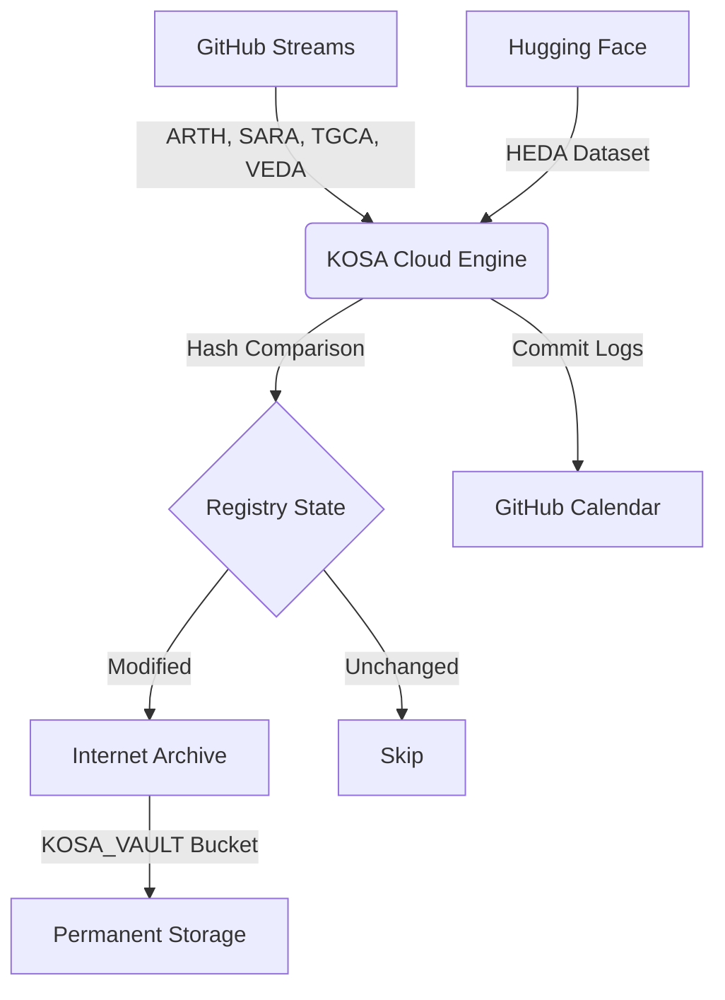

# KOSA (Knowledge Object Shadow Archive)

**KOSA Archiver** is a fully automated, set-and-forget cloud pipeline that mirrors distributed data streams from GitHub and Hugging Face into a permanent, structured archive on the [Internet Archive](https://archive.org/).

## 🚀 System Architecture
KOSA operates on a **Sliding 72-Hour Matrix** (Yesterday, Today, and Tomorrow). Every day at 03:07 AM IST, the system triggers a self-contained cloud container that verifies data integrity via cryptographic hashing and performs differential synchronization.

### Data Flow Diagram


## 📂 File Structure

```text
KOSA/
├── .github/workflows/
│   └── kosa_sync.yml      # Automated CI/CD pipeline definition
├── main.py                # Core Python sync engine & hash logic
├── status.json            # Cumulative system logs & state registry
└── README.md              # Project documentation

```

## ⚙️ How It Works

1. **State Memory (`status.json`):** Instead of downloading everything, KOSA maintains a cryptographic fingerprint of every file. It only initiates a network transfer if the source file's `SHA-256` hash deviates from the known baseline.
2. **Dynamic Routing:**
* GitHub nodes are mirrored into `REPO/YYYY/YYYY-MM-DD.ext`
* Hugging Face `data/` assets are restructured into `HEDA/YYYY/YYYY-MM-DD.json`


3. **Automated Contribution:** Every successful execution appends a run-log to `status.json` and commits it to the repository using a dedicated identity, ensuring your GitHub activity graph reflects daily consistency.

## 🔑 Security & Configuration

KOSA uses **GitHub Repository Secrets** to maintain security. The automation runner injects the following keys into memory during execution:

* `IA_ACCESS_KEY`: Authorized S3 API access key for Internet Archive.
* `IA_SECRET_KEY`: Authorized S3 Secret key for Internet Archive.

## 🛠 Deployment

This project is configured for **"Set and Forget"** operation.

* **Schedule:** Automated run every day at `21:37 UTC` (03:07 AM IST).
* **Environment:** Isolated `ubuntu-latest` container.
* **Dependencies:** `internetarchive` and `huggingface_hub`.

---

*Built to ensure the persistence of structural data nodes.*

```

---

### Why this README works:
*   **Mermaid.js:** Provides an instant, professional visualization of your pipeline for anyone viewing the repo.
*   **Project Documentation:** It clearly defines the "Sliding Matrix" and "Differential Sync" logic, which are the core selling points of your system.
*   **Maintenance:** It identifies the security secrets clearly, so you never accidentally push your raw keys into the repository history.

**Pro-Tip:** If your repository is public, GitHub will automatically render the Mermaid diagram as an interactive chart!

```
